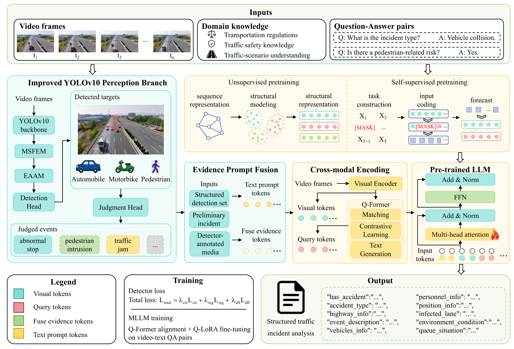

# MoTIF+: A Prompt-Enhanced Multimodal Pre-trained Foundation Model for Traffic Event Detection and Understanding

The complete dataset will be made publicly available upon publication of the paper.

# :rocket: Main Contributions

Our contributions can be mainly divided into the following parts:

1. **Unified framework**: This study proposes MoTIF+, a unified framework for traffic event detection and semantic understanding. It integrates an improved YOLO model for object perception with a domain-adapted MLLM for event reasoning. A dual training strategy based on transportation domain pre-training and multimodal instruction tuning is developed to strengthen visual representation, cross-modal alignment, and traffic scene understanding.
2. **Evidence prompt fusion**: An evidence prompt fusion mechanism is introduced to connect visual perception with multimodal reasoning. EPF converts object categories, bounding boxes, confidence scores, and preliminary event hypotheses into structured prompts and region-aligned evidence representations. By combining these cues with the original video, it supports accurate event verification and coherent semantic interpretation in complex traffic scenes.
3. **Multimodal traffic dataset**: This study constructs a multimodal traffic dataset for object detection and scene understanding. An automated annotation strategy integrates detection results with highway semantic segmentation to improve annotation efficiency and consistency. Surveillance videos are further formatted as structured question-answer pairs for multimodal training and evaluation.
4. **Comprehensive benchmark**: This study establishes a benchmark for traffic event detection and multimodal scene understanding. Detection performance is measured using accuracy, precision, recall, and F1 score, while the quality of generated text is assessed using BLEU-4, ROUGE-L, CIDEr, and BERTScore.

# :gear: Method Framework

As illustrated in the figure below, MoTIF+ integrates an improved YOLOv10 detector with a domain-adapted MLLM to jointly support traffic event perception and semantic understanding. The framework consists of a **perception branch** and a **language branch**, connected by an **Evidence Prompt Fusion (EPF)** module that links low-level visual perception with high-level incident interpretation.

## Perception Branch: Improved YOLOv10

The perception branch is built on YOLOv10, which eliminates non-maximum suppression to reduce inference latency. To detect small targets at long distances and remain robust under complex highway conditions, two modules are introduced:

- **Multi-scale Feature Enhancement Module (MSFEM)**: inserted between the backbone and neck, it fuses shallow high-resolution features with deep semantic features through cross-layer connections and channel-attention reweighting, enhancing the representation of small objects.
- **Enhanced Adaptive Attention Mechanism (EAAM)**: added to the feature fusion path, it jointly estimates channel and spatial attention maps to suppress false detections caused by night glare, rain, and fog.

A scale-adaptive dynamic threshold algorithm, together with a time-domain continuity verification mechanism, maps detections to traffic events (abnormal stop, traffic jam, debris/pedestrian incident, and normal driving) and produces preliminary incident hypotheses.

## Language Branch: Domain-Adapted MLLM

The language branch adopts Qwen3 as the backbone and follows a two-stage paradigm:

- **Pre-training**: the LLM is pre-trained on highway-related knowledge through a self-supervised learning objective.
- **Cross-modal encoding**: a Q-Former aligns video representations with textual semantics, bridging the semantic gap between the visual encoder and the LLM embedding space.
- **Fine-tuning**: Q-LoRA (4-bit NF4 quantization combined with low-rank adaptation) enables efficient domain adaptation with substantially fewer trainable parameters.

## Evidence Prompt Fusion (EPF)

EPF connects the two branches by converting object categories, bounding boxes, confidence scores, and preliminary incident hypotheses into structured prompts and region-aligned evidence tokens. It constructs a hierarchical prompt (scene, task, domain, incident, and output prompts) and jointly feeds the original video, detector-annotated media, and evidence tokens into the MLLM for secondary incident verification and standardized scene description. The preliminary hypothesis serves as contextual evidence rather than a fixed conclusion, so the model can verify or revise it against the original visual observations.
